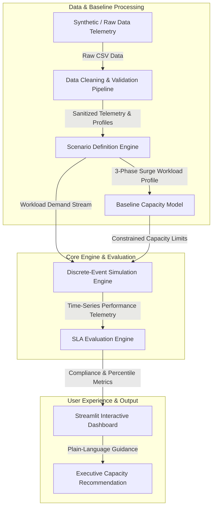

# System Architecture & Data Flow

## Executive Disclaimer

> [!IMPORTANT]
> **SIMULATION SYSTEM DISCLAIMER**: This software is a scenario-driven capacity planning simulator designed for research, testing, and infrastructure right-sizing. **It is not a real-time production emergency monitoring system** and does not interface directly with live production traffic or public safety alert dispatch networks. All metrics, disaster profiles, and system behaviors are derived from discrete-event simulation models based on historical traffic patterns.

---

## High-Level Pipeline Architecture

The Peak-Demand Capacity Simulator processes traffic patterns through an end-to-end multi-stage pipeline, transforming raw infrastructure metrics into actionable executive recommendations:

---

## Core Pipeline Stages

### 1. Data Ingestion & Profiling (`src/data/`)
- Generates synthetic 24-hour historical traffic telemetry (~3,888 minutes at 10-second granularity).
- Computes statistical summaries (mean, median, 95th/99th percentiles, burst ratios).

### 2. Data Cleaning & Validation (`src/data/cleaner.py`)
- Sanitizes raw telemetry: imputation of missing values, zero-clipping of negative rates, range enforcement for utilization [0-100%].
- Computes exact total capacity math (`available_instances * capacity_per_instance`).

### 3. Scenario Definition Engine (`src/simulation/scenarios.py`)
- Generates realistic non-uniform 3-phase demand profiles across 5 severity tiers:
  - `NORMAL` (1.0x baseline)
  - `SEASONAL_PEAK` (1.8x baseline)
  - `BREAKING_NEWS` (2.5x baseline)
  - `DISASTER_PEAK` (4.0x baseline)
  - `EXTREME_DISASTER` (6.5x baseline)
- Models ramp-up, sustained peak, and recovery decay phases.

### 4. Baseline Capacity Model (`src/capacity/baseline.py`)
- Calculates infrastructure capacity using realistic constrained server instances.
- Demonstrates why average-demand capacity planning fails under disaster spikes.

### 5. Simulation Engine (`src/simulation/simulator.py`)
- Discrete-event simulation (10s timesteps) modeling incoming request rates, queue accumulation/drainage, M/M/1 queue latency, HTTP 503 error rates, and auto-scaling propagation delay.

### 6. SLA Evaluation Engine (`src/sla/evaluator.py`)
- Evaluates simulation time-series against strict SLAs:
  - **Latency SLA**: p95 Latency <= 500 ms
  - **Availability SLA**: Error Rate <= 1.0%
- Calculates overall compliance percentage and SLA status.

### 7. Interactive Dashboard (`dashboard/app.py`)
- Streamlit Web Interface featuring 8 interactive sections, live parameter sliders, Plotly time-series visualisations, side-by-side scenario matrix, sensitivity classification, and RBAC permission enforcement.

### 8. Executive Recommendation (`src/simulation/experiment.py`)
- Synthesizes quantitative simulation outputs into plain-language guidance for non-technical emergency leadership.

---

## Distinction: Simulation vs. Real-World Systems

| Aspect | Simulation Model (This System) | Real-World Production System |
| :--- | :--- | :--- |
| **Request Generation** | Synthetic 3-phase mathematical surge profiles | Unpredictable, real-time public web traffic |
| **Server Provisioning** | Simulated step-function instance scaling with fixed delay | Cloud auto-scaling groups with variable boot times |
| **Latency Modeling** | M/M/1 queuing theory & CPU utilization scaling | Multi-tier network, DB, and CDN response times |
| **System Scope** | Strategic capacity planning & risk evaluation | Real-time traffic routing & emergency info delivery |
