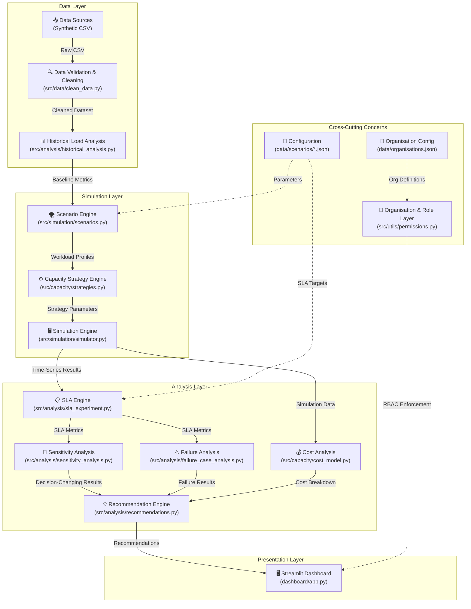

# Final System Architecture

## Executive Disclaimer

> **SIMULATION SYSTEM DISCLAIMER**: This software is a scenario-driven capacity planning simulator designed for research, testing, and infrastructure right-sizing. **It is not a real-time production emergency monitoring system** and does not interface directly with live production traffic or public safety alert dispatch networks. All metrics, disaster profiles, and system behaviors are derived from discrete-event simulation models.

---

## End-to-End Pipeline Architecture

```
Data Sources (Synthetic/Historical CSV)
    ↓
Data Validation & Cleaning (src/data/clean_data.py)
    ↓
Historical Load Analysis (src/analysis/historical_analysis.py)
    ↓
Scenario Engine (src/simulation/scenarios.py)
    ↓
Capacity Strategy Engine (src/capacity/strategies.py)
    ↓
Simulation Engine (src/simulation/simulator.py)
    ↓
SLA Engine (src/analysis/sla_experiment.py)
    ↓
Cost Analysis (src/capacity/cost_model.py)
    ↓
Sensitivity Analysis (src/analysis/sensitivity_analysis.py)
    ↓
Failure Analysis (src/analysis/failure_case_analysis.py)
    ↓
Recommendation Engine (src/analysis/recommendations.py)
    ↓
Streamlit Dashboard (dashboard/app.py)
```

---

## Detailed Architecture Diagram



---

## Module Inventory

### Data Layer

| Module | File | Purpose | Lines |
|:---|:---|:---|:---:|
| Data Generator | `src/data/generate_dataset.py` | Generates synthetic 3,888-row emergency load dataset | 735 |
| Data Cleaner | `src/data/clean_data.py` | 15-step cleaning pipeline preserving disaster spikes | 374 |
| Data Loader | `src/data/loader.py` | CSV loading and schema validation | 85 |
| Data Profiler | `src/data/profiler.py` | Statistical profiling and quality metrics | 137 |
| Dashboard Profiler | `dashboard/data_profiler.py` | Interactive data profiling UI | 430 |

### Simulation Layer

| Module | File | Purpose | Lines |
|:---|:---|:---|:---:|
| Scenario Engine | `src/simulation/scenarios.py` | 7 workload scenarios with 3-phase curves | 253 |
| Scenario Validation | `src/simulation/scenario_validation.py` | Configuration validation and bounds checking | 450 |
| Simulator | `src/simulation/simulator.py` | Discrete-event simulation with queue dynamics | 338 |
| Experiment Engine | `src/simulation/experiment.py` | Before vs After comparison experiments | 260 |
| Scenario Runner | `src/simulation/run_scenarios.py` | Multi-scenario batch execution | 217 |

### Capacity & Cost Layer

| Module | File | Purpose | Lines |
|:---|:---|:---|:---:|
| Baseline Model | `src/capacity/baseline.py` | Constrained infrastructure evaluation | 267 |
| Strategy Evaluator | `src/capacity/strategies.py` | 5 capacity planning strategies comparison | 318 |
| Cost Model | `src/capacity/cost_model.py` | Synthetic economic trade-off analysis | 99 |

### Analysis Layer

| Module | File | Purpose | Lines |
|:---|:---|:---|:---:|
| Historical Analysis | `src/analysis/historical_analysis.py` | Aggregate operational metrics | 393 |
| SLA Experiment | `src/analysis/sla_experiment.py` | Formal SLA comparison engine | 243 |
| Sensitivity Analysis | `src/analysis/sensitivity_analysis.py` | 8-parameter controlled experiments | 637 |
| Error Analysis | `src/analysis/error_analysis.py` | SLA violation root cause classifier | 294 |
| Failure Case Analysis | `src/analysis/failure_case_analysis.py` | 8 stress/failure test conditions | 854 |
| Recommendation Engine | `src/analysis/recommendations.py` | 5-field explainable recommendations | 464 |

### Permission Layer

| Module | File | Purpose | Lines |
|:---|:---|:---|:---:|
| RBAC Engine | `src/utils/permissions.py` | 4 roles, 4 orgs, metric redaction | 349 |
| Auth Bridge | `src/auth/permissions.py` | Legacy compatibility bridge | 21 |

### Presentation Layer

| Module | File | Purpose | Lines |
|:---|:---|:---|:---:|
| Main Dashboard | `dashboard/app.py` | 12-section interactive Streamlit dashboard | 1,393 |
| Landing Page | `main.py` | Project overview and navigation | 437 |

---

## Role & Permission Architecture

```
┌─────────────────────────────────────────────────────┐
│                  RBAC Permission Layer                │
├──────────┬──────────┬──────────┬─────────────────────┤
│  Viewer  │ Analyst  │ Operator │   Administrator     │
├──────────┼──────────┼──────────┼─────────────────────┤
│ View     │ View     │ View     │ View                │
│ Dashboard│ + Run    │ + Config │ + Org Config        │
│ + Basic  │ Scenarios│ Capacity │ + SLA Config        │
│ Results  │ + Compare│ + Failure│ + System Config     │
│          │ + History│ Testing  │ + All Reports       │
│          │ + SLA    │          │                     │
│          │ + Sens.  │          │                     │
└──────────┴──────────┴──────────┴─────────────────────┘

┌─────────────────────────────────────────────────────┐
│              Organisation Restrictions               │
├──────────────────────┬──────────────────────────────┤
│ Emergency Ops Centre │ Full access, all scenarios   │
│ Government Agency    │ Full access, audit focus     │
│ Healthcare Partner   │ 4 scenarios, strict SLA      │
│ External Info Partner│ 3 scenarios, metrics redacted│
└──────────────────────┴──────────────────────────────┘
```

> **Security Note**: Role selection is implemented as an application-level workflow demonstration. Production deployment would require proper authentication, authorization, and session management infrastructure.

---

## Data Flow Summary

1. **Raw Data** (`data/raw/emergency_load_raw.csv`): 3,888 rows × 33 columns of synthetic operational telemetry
2. **Cleaned Data** (`data/processed/emergency_load_cleaned.csv`): Validated, deduplicated, interpolated dataset
3. **Scenario Configuration** (`data/scenarios/advanced_scenarios.json`): 7 scenario definitions with configurable parameters
4. **SLA Configuration** (`data/scenarios/sla_config.json`): Configurable SLA targets (p95 latency, error rate, compliance %)
5. **Organisation Configuration** (`data/organisations.json`): 4 organisations with allowed scenarios and SLA targets
6. **Simulation Outputs** (`outputs/simulation_results/`): Per-scenario time-series CSV exports
7. **Analysis Outputs** (`outputs/`): 30+ CSV and Markdown reports

---

## Technology Stack

| Component | Technology | Version |
|:---|:---|:---|
| Runtime | Python | 3.10+ |
| Dashboard | Streamlit | 1.36+ |
| Data Processing | Pandas | 2.2.2 |
| Numerical Computing | NumPy | 1.26.4 |
| Interactive Charts | Plotly | 5.22.0 |
| Static Charts | Matplotlib | 3.9.0 |
| Statistical Analysis | SciPy | 1.13.1 |
| Configuration | PyYAML | 6.0.1 |
| Testing | Pytest | 8.2.2 |

---

## Distinction: Simulation vs Real-World Systems

| Aspect | Simulation Model (This System) | Real-World Production System |
|:---|:---|:---|
| **Request Generation** | Synthetic 3-phase mathematical surge profiles | Unpredictable, real-time public web traffic |
| **Server Provisioning** | Simulated step-function instance scaling with fixed delay | Cloud auto-scaling groups with variable boot times |
| **Latency Modeling** | M/M/1 queuing theory & CPU utilization scaling | Multi-tier network, DB, and CDN response times |
| **Cost Model** | Synthetic simulation assumptions for trade-off analysis | Actual cloud provider billing with variable pricing |
| **Security** | Application-level role selection (demonstration only) | SSO, OAuth2, MFA, encrypted sessions |
| **System Scope** | Strategic capacity planning & risk evaluation | Real-time traffic routing & emergency info delivery |
